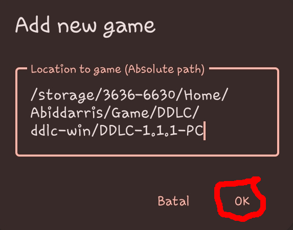
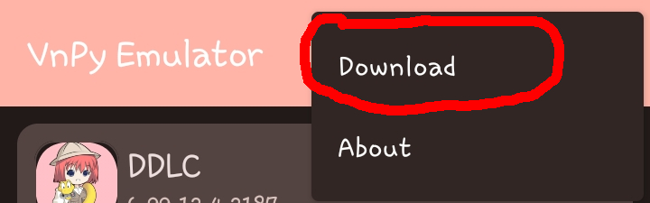

# How to use **VnPy-Emulator**

## Requirement
1. **VnPy-Emulator app**: Download it from the releases page.
2. The **game** you want to run (keep in mind some games may not work due to platform-specific code).
3. **Android 5.0 (Lollipop)** or later.
4. A **File Manager app** (e.g., **ZArchiver**) to extract game files.

## Adding the game
1. **Extract the Game**:
   which is typically in **zip** format. Use your file manager (e.g., **ZArchiver**) to extract the files to your desired location.
2. **Get the Absolute Path of the Game**:
   Navigate to the folder where the game is located, and find the **absolute path** at the top-left of the screen if you use **ZArchiver**

   **Important**: Keep this **absolute path** handy, as you'll need it in the next steps.
3. **Adding the game**:
- **Open VnPy-Emulator** and tap the **Add Button** in the top-right corner of the screen.
  
- A dialog will appear with a text field then paste the **absolute path** of the game into the text field.
  
  
- After entering the path, click **Ok** then wait for the emulator to process the game. An internet connection is required if this is your first time adding a game.
  
- Once completed, you will see a dialog where you can change the **game's name** or the **icon** by clicking on them.
  
- Review at the **patch version** and **plugin**. They should automatically be filled in by the emulator. If the emulator cannot detect, you must select the closest Ren'Py version for both plugins or patches. **Note**: There is **no guarantee** that the game will work perfectly with an unsupported Ren'Py version.
  
- After that, click **Ok**. **VnPy-Emulator** will now download the necessary patches for your game's Ren'Py version.
  
4. **Install a Plugin**
- Tap the **more options** button in the top-right corner.
  
  
- To find the correct plugin, remember which Ren'Py version your game is using! For example, in the previous step, the selected version was `6.99.12.2187.3`. Look for `6.99.12.2187` and tap expand it.
  
- Next, locate the sub-version. In this case, the sub-version is `3`. Tap the download button and wait for the download to complete.
  
- Once the download finishes, an install prompt will automatically appear. Click Install and wait for the plugin to be installed.

5. **Open the game**
- Return to the main menu, click on your game, and enjoy!
  
  
